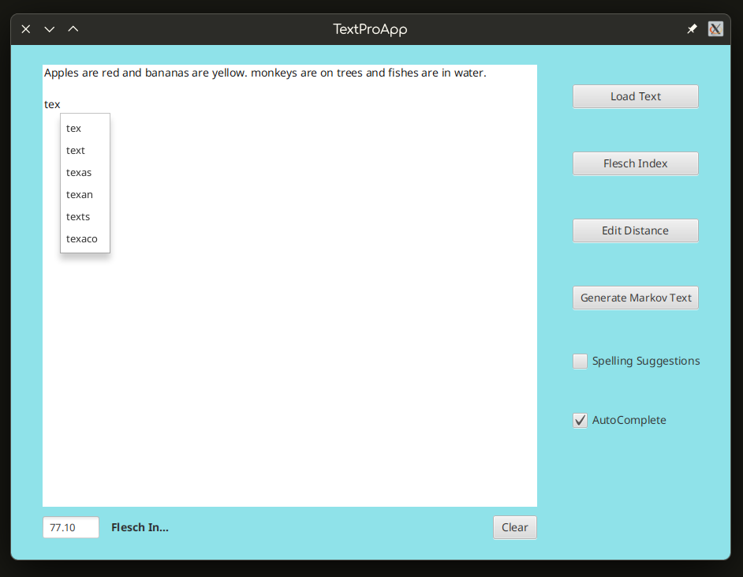

# MOOCTextEditor

Text Editor project for Data Structures and Performance course offered by UCSanDiego via Coursera.

---

## Features

### Flesch Readability Index Calculation


### Markov Text Generation


### Text Autocompletion


### Spelling Suggestions


### Edit Distance Computation


---

## Usage

### Prerequisites
* **Java:** JDK 8
* **UI Toolkit:** JavaFX
* **Testing:** JUnit 4

### Getting Started

1. **Clone the repository:**
   ```bash
   git clone [https://github.com/mohamed-ali087/MOOCTextEditor.git](https://github.com/mohamed-ali087/MOOCTextEditor.git)
2. import the project into your IDE (Eclipse or Intellij).
3. Launch the application by running `src/application/mainApp.java`.
